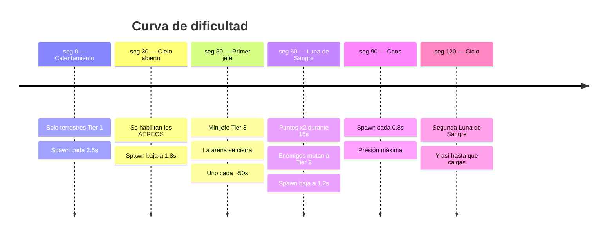
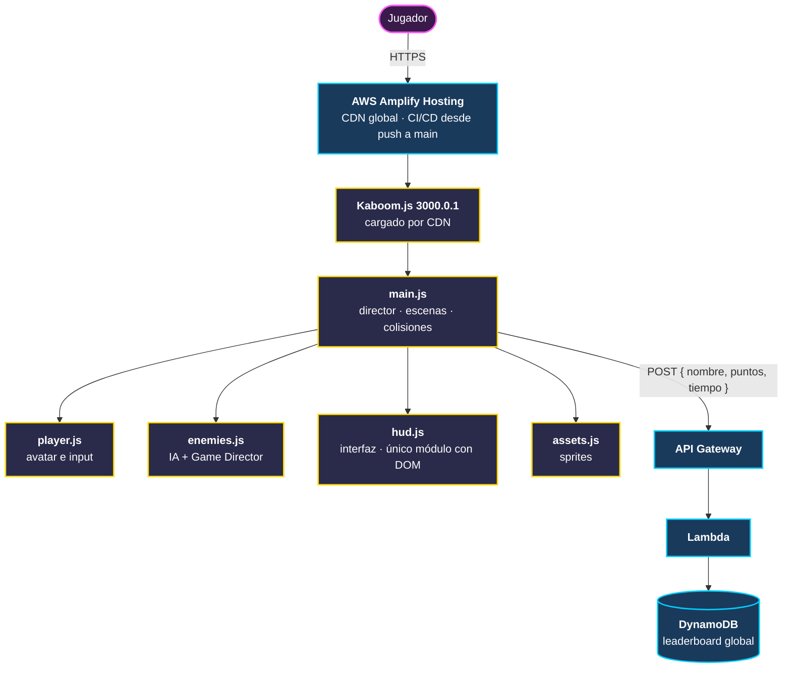

# Xólotl Warrior

> Un fantasma guerrero defiende la última puerta del Mictlán.

### [▶ JUGAR AHORA](https://main.d5hw5vsttp0x1.amplifyapp.com)

**https://main.d5hw5vsttp0x1.amplifyapp.com**

Sin instalación, sin descargas, sin registro. Abre el link y juega.

**Hackathon Kiro + CódigoFacilito** · Equipo **Orfecalli** (equipo #98)

> **Estado del proyecto:** el juego ya está **completo y jugable de principio a fin** — menú, gameplay, jefes, economía, tienda, leaderboard en la nube y game over funcionan. Lo que sigue en la mesa de trabajo son **detalles estéticos**: efectos de sonido, música, animaciones de impacto y sprites para los enemigos. Ver [Estado y roadmap](#estado-y-roadmap).

---

## La temática

El protagonista es un **fantasma** — un espíritu pequeño, flotante y terco, guiño directo al fantasma de **Kiro**, la herramienta con la que se construyó buena parte de este proyecto. Pero no es un fantasma cualquiera: carga el nombre y el deber de **Xólotl**.

En la mitología mexica, Xólotl es el dios con cabeza de perro, gemelo de Quetzalcóatl y **guía de las almas** en su travesía por el **Mictlán**, el inframundo de nueve niveles. Era él quien acompañaba al sol en su descenso nocturno y quien cuidaba que los muertos llegaran a su destino.

En *Xólotl Warrior* esa travesía se rompió.

Las almas dejaron de cruzar. Lo que sube del Mictlán ya no son difuntos en paz, sino **criaturas corrompidas** que marchan hacia el **Núcleo Sagrado**, el pilar dorado que sostiene el equilibrio entre el mundo de los vivos y el de los muertos. Si el Núcleo cae, el paso se cierra para siempre.

Tú eres ese fantasma. No puedes morir del todo, pero sí puedes fallar. Tu trabajo es simple y desesperado: **quedarte de pie el mayor tiempo posible** mientras las hordas se hacen más rápidas, más grandes y más numerosas.

Y cada cierto tiempo, el cielo se tiñe de rojo. **La Luna de Sangre** despierta, y con ella todo vale el doble: para bien y para mal.

### Los pilares temáticos

| Elemento | Significado en el juego |
|---|---|
| **El Núcleo** | Pilar dorado al centro del mapa. Es lo que defiendes. Tiene 5 vidas. Si llega a 0, se acabó. |
| **Las Almas** | La moneda del juego. Cada enemigo purificado libera un alma que cae con físicas reales al suelo. |
| **El Altar** | La tienda. Ahí ofrendas almas para desbloquear encarnaciones alternativas del fantasma. |
| **La Luna de Sangre** | Evento cada 60 segundos, dura 15. La pantalla se tiñe de carmesí y todo puntúa **x2**. |
| **Los Orbes** | Fragmentos elementales (Fuego, Hielo, Rayo) que caen de los enemigos y transforman tu combate por 12 segundos. |
| **Los Tiers** | La corrupción muta. Tier 1 son soldados rasos; Tier 2 mutados; Tier 3 son **minijefes colosales** que hacen temblar la cámara al caminar. |

---

## Cómo jugar

### El objetivo

**Sobrevive.** No hay meta, no hay final feliz. Es un *survival* infinito: acumulas puntos por cada segundo que aguantas y por cada enemigo que purificas. Cuando el Núcleo o tú caen, registras tus iniciales estilo arcade y tu puntaje viaja a la nube para competir contra todos los demás jugadores.

### Las dos barras que te matan

Tienes **dos vidas independientes** y perder cualquiera de las dos termina la partida:

- **Núcleo — 5 corazones dorados.** Cada enemigo que lo alcanza le quita 1 vida (los jefes Tier 3 le quitan **3**).
- **Xólotl — 3 corazones cian.** Si un enemigo te toca a *ti*, pierdes 1 vida (pero el enemigo también muere en el choque).

Esto crea la tensión central del juego: **¿te lanzas al frente a interceptar, o te quedas cerca del Núcleo?** Ir al frente protege el pilar pero te expone; quedarte atrás te mantiene sano pero deja que la horda se acumule.

### Controles

| Tecla | Acción | Detalle |
|---|---|---|
| `A` `D` o `←` `→` | **Moverse** | Velocidad base 300 |
| `SHIFT` | **Correr** | Duplica la velocidad a 600 mientras lo mantengas |
| `SPACE` | **Saltar** | Impulso de 700 desde el suelo |
| `SPACE` **otra vez en el aire** | **Modo Vuelo** | Anula tu gravedad y quedas flotando |
| `W` `S` o `↑` `↓` | **Volar** | Solo funciona en modo vuelo. Aterrizar lo desactiva |
| `Q` | **Dash Espectral** | Te vuelves semitransparente e **invulnerable** 0.2s. Recarga en 1s |
| `J` | **Espada** | Cuerpo a cuerpo, **2 de daño**. Hitbox al frente. Cooldown 0.25s |
| `K` | **Láser Espiritual** | Proyectil a distancia, **1 de daño**. Cooldown 0.25s |
| `E` | **Ulti Espiritual** | Onda expansiva. Requiere **100% de energía** |
| `ESC` | **Pausa** | Congela absolutamente todo |
| `M` | **Volver al menú** | Solo funciona en pausa |
| `R` | **Reiniciar** | Solo en la pantalla de Game Over |

### La Ulti Espiritual (`E`), tu botón de pánico

Cada enemigo purificado te carga **+25% de energía**. A las **4 bajas** la barra llega a 100% y el HUD te avisa. Al presionar `E`:

- La pantalla destella cian, la cámara se sacude fuerte
- Una onda dorada se expande desde tu posición hasta cubrir el mapa
- **Todos los enemigos normales mueren al instante**
- Los **jefes Tier 3 reciben 8 de daño** (no mueren, pero les duele)

Guárdala para cuando estés rodeado o cuando un jefe esté por llegar al Núcleo.

### Los Orbes Elementales

Cada enemigo tiene un **15% de probabilidad** de soltar un orbe. Al recogerlo cambias de color y ganas un efecto durante **12 segundos**:

| Orbe | Color | Efecto |
|---|---|---|
| **Fuego** | Naranja | **Duplica tu daño**: espada 2 → **4**, láser 1 → **2** |
| **Hielo** | Azul | Tu láser **congela**: el enemigo impactado baja a **30% de velocidad** por 3 segundos |
| **Rayo** | Amarillo | Tu espada **encadena**: golpea también a todo enemigo en un radio de 100px por 2 de daño |

**Fuego** es el más directo, **Hielo** es control de multitudes a distancia, y **Rayo** es el rey cuando la horda se apelmaza.

### Cómo se calcula tu puntaje

| Fuente | Puntos |
|---|---|
| Cada segundo sobrevivido | **+1** |
| Enemigo terrestre purificado | **+10** |
| Enemigo aéreo purificado | **+15** *(vale más porque se mueve en dos ejes)* |
| **Durante la Luna de Sangre** | **TODO x2** |

> Solo puntúan las bajas que causas **tú** con espada, láser o ulti. Un enemigo que se estrella contra el Núcleo o contra ti muere, pero **no te da puntos**: solo te quita vida.

**Tu mejor puntaje se guarda localmente** (`localStorage`) y aparece en el HUD como *Record*, incluso si cierras el navegador.

### La curva de dificultad

El juego tiene un **Game Director** que sube la presión sola, con el reloj:



Antes de cada aéreo o jefe aparece un **signo de exclamación rojo parpadeante (`!`)** en el borde por donde va a entrar. Es tu único aviso, apréndete a leerlo.

Mientras haya un **jefe vivo, el spawn se detiene**: la arena se "cierra" para que sea un duelo limpio contra el minijefe.

### El bestiario

| Enemigo | Vida | Velocidad | Comportamiento |
|---|---|---|---|
| Terrestre T1 (verde) | 3 | 130 | Camina en línea recta hacia el Núcleo |
| Terrestre T2 (naranja) | 5 | ×1.5 | Igual, pero más duro y más rápido |
| **Terrestre T3 (rojo, jefe)** | **15** | ×0.5 | Colosal (2.5x tamaño). **Sacude la cámara al caminar.** Quita 3 vidas al Núcleo |
| Aéreo T1 (rosa) | 1 | ×1.2 | Vuela en diagonal directa al Núcleo |
| Aéreo T2 (morado) | 2 | ×1.8 | Vuela **en zigzag senoidal**, difícil de interceptar |
| **Aéreo T3 (violeta, jefe)** | **12** | ×0.6 | Colosal volador. Ignora todo el terreno |

Golpear a un enemigo sin matarlo lo empuja hacia atrás (**knockback**), útil para ganar espacio, pero los jefes **no retroceden**.

### El Altar (tienda de skins)

Cada enemigo purificado tiene **60% de probabilidad** de soltar un alma, que **rebota y cae al suelo con físicas reales**. Recógela caminando encima. Las almas se guardan entre partidas.

| Encarnación | Costo | Color |
|---|---|---|
| **Xólotl Clásico** | Gratis | Blanco |
| **Serpiente Emplumada** | 30 almas | Verde esmeralda |
| **Calavera del Mictlán** | 60 almas | Rosa magenta |

Son **puramente cosméticas**, ninguna da ventaja. Es progresión por prestigio, no *pay-to-win*.

### El Leaderboard

Al morir entras al modo arcade clásico: **registra tus 3 iniciales** con `↑`/`↓` para cambiar letra, `←`/`→` para moverte entre ellas, y `ENTER` para enviar. Tu puntaje viaja a un **API Gateway + Lambda + DynamoDB en AWS**, así que compites contra todo el mundo, no solo contra tu navegador.

---

## Arquitectura



**Decisión clave: cero build step.** No hay Webpack, ni Vite, ni `npm install` para jugar. Módulos ES6 nativos + Kaboom desde CDN. El navegador *es* el runtime. Esto significa que el deploy es literalmente copiar archivos, el pipeline de CI/CD tarda segundos, y cualquier persona del equipo puede levantar el proyecto con un comando.

### Estructura del repositorio

Cada carpeta tiene su propio README explicando qué hace, por qué existe y cómo funciona:

```
Xolotl_Warrior/
├── README.md              ← estás aquí
├── frontend/              → el juego completo  ......... [README](frontend/README.md)
│   ├── index.html         · esqueleto DOM + capa del HUD
│   ├── css/               → estilos y capa de interfaz  [README](frontend/css/README.md)
│   ├── js/                → toda la lógica del juego    [README](frontend/js/README.md)
│   └── assets/            → sprites y recursos          [README](frontend/assets/README.md)
├── backend/               → API de puntajes  ........... [README](backend/README.md)
└── docs/                  → documentación técnica ...... [README](docs/README.md)
```

---

## Stack

| Capa | Tecnología | Por qué |
|---|---|---|
| **Motor** | [Kaboom.js 3000.0.1](https://kaboomjs.com/) | Motor 2D con sistema entidad-componente, físicas y colisiones listas. Se carga por CDN, cero instalación |
| **Frontend** | JavaScript vanilla (ES6 Modules), HTML5, CSS3 | Sin frameworks **a propósito**: menos peso, cero build, arranque instantáneo |
| **Hosting** | AWS Amplify Hosting | CDN global en Edge, HTTPS automático, CI/CD desde `main` |
| **API** | AWS API Gateway + Lambda | Serverless: sin servidores que mantener, escala sola, cuesta ~$0 en reposo |
| **Base de datos** | AWS DynamoDB | NoSQL serverless para el leaderboard global |
| **Contenedores** | Docker (Node 18 Alpine) | Para correr el backend Express en local o portarlo a ECS/Fargate |

---

## Correrlo en local

El juego usa **módulos ES6**, así que abrir `index.html` directo con doble clic **no funciona** (el navegador bloquea los módulos por CORS con protocolo `file://`). Necesitas un servidor HTTP local:

```bash
git clone https://github.com/GabrielVazquez12/Xolotl_Warrior.git
cd Xolotl_Warrior/frontend

# Con Python (viene preinstalado en Linux/macOS)
python3 -m http.server 8000

# ...o con Node
npx serve
```

Abre **http://localhost:8000** y listo. **No hay `npm install`, no hay build.**

Para el backend local (opcional, la versión desplegada ya funciona sin esto):

```bash
cd backend
npm install
node server.js     # → http://localhost:3000
```

---

## Estado y roadmap

### Terminado y jugable

- [x] Loop de juego completo: menú → partida → game over → reinicio
- [x] Movimiento, carrera, salto, **modo vuelo** y **dash espectral con invulnerabilidad**
- [x] Combate dual: espada cuerpo a cuerpo + láser a distancia, con daños distintos
- [x] **Ulti Espiritual** con barra de energía visible en el HUD, que se llena con cada baja y se pone dorada al estar lista
- [x] 6 tipos de enemigos en 3 tiers, terrestres y aéreos, con IA de persecución
- [x] **Minijefes** con arena cerrada y screen shake
- [x] **Game Director** con curva de dificultad progresiva y avisos de alerta
- [x] **Luna de Sangre**: evento temporizado con puntos x2 y tinte de pantalla
- [x] **3 orbes elementales** que modifican el combate
- [x] **Economía de almas** con drops físicos que rebotan
- [x] **El Altar**: tienda de skins con persistencia en `localStorage`
- [x] HUD completo: vidas, tiempo, puntaje, récord local y avisos
- [x] **Pausa absoluta** (congela entidades, timers y el Game Director)
- [x] Sistema de récord local persistente
- [x] **Leaderboard global** con registro de iniciales estilo arcade → AWS
- [x] Despliegue en producción con CI/CD automático

### En pulido: solo estética, nada bloqueante

- [ ] **Efectos de sonido** — el módulo `audio.js` ya está escrito con las 8 funciones (espada, láser, dash, impactos, muerte, game over), solo falta producir los archivos `.wav` y descomentar las llamadas
- [ ] **Música de fondo** — loop de gameplay y tema de game over, con la infraestructura ya lista
- [ ] **Sprites de enemigos** — actualmente se renderizan como primitivas geométricas de colores (funciona perfecto, pero merecen arte)
- [ ] Animaciones de impacto y partículas al purificar enemigos
- [ ] Pantalla in-game del Top 10 del leaderboard global

**Nada de esto impide jugar.** El juego está completo, esto es la capa de brillo.

---

## Documentación técnica

| Documento | Contenido |
|---|---|
| [`docs/architecture.md`](docs/architecture.md) | Filosofía de diseño, separación de responsabilidades y máquina de estados |
| [`docs/player.md`](docs/player.md) | Controlador del avatar, cinemática y habilidades |
| [`docs/enemies.md`](docs/enemies.md) | IA, tiers de amenaza y Game Director |
| [`docs/mechanics.md`](docs/mechanics.md) | Combate elemental, Luna de Sangre y economía |
| [`docs/hud.md`](docs/hud.md) | Interfaz, gestión del DOM y sistema de puntuación |
| [`docs/assets.md`](docs/assets.md) | Carga de recursos y mapeo de sprite sheets |
| [`docs/ci-cd.md`](docs/ci-cd.md) | Infraestructura cloud, pipeline y despliegue |

---

## Créditos

**Equipo Orfecalli** — equipo #98
Proyecto desarrollado para el **Hackathon de Kiro + CódigoFacilito**.

Repositorio: [github.com/GabrielVazquez12/Xolotl_Warrior](https://github.com/GabrielVazquez12/Xolotl_Warrior)
