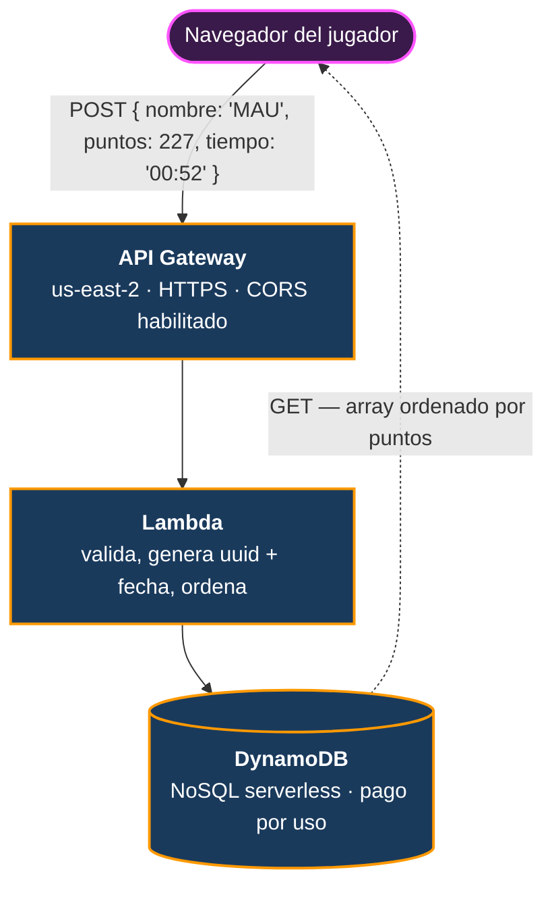

# `backend/` — API de puntajes

> El leaderboard global. La única parte del proyecto que no corre en el navegador.

[← Volver al README principal](../README.md)

---

## Qué hay aquí

```
backend/
├── server.js          63 líneas · API Express para desarrollo local
├── package.json       express + cors
├── Dockerfile         Node 18 Alpine, expone :3000
├── .dockerignore      excluye node_modules
└── package-lock.json
```

---

## Lo primero que hay que entender: hay dos backends

Este es el punto que más confunde al leer el repo, así que va por delante.

| | **Desarrollo local** | **Producción** |
|---|---|---|
| **Qué corre** | `server.js` (Express) | AWS Lambda |
| **Dónde vive el código** | Este directorio | Consola de AWS (**no está en el repo**) |
| **Almacenamiento** | `scores.json` en disco | DynamoDB |
| **URL** | `http://localhost:3000` | `https://k572xn1fxj.execute-api.us-east-2.amazonaws.com/default/XolotlApi` |
| **Quién lo usa** | Nadie por defecto | **El juego desplegado, ahora mismo** |

**El juego que juegas en el link NO habla con `server.js`.** Habla directo con API Gateway. El endpoint está escrito en [`frontend/js/main.js:477`](../frontend/js/README.md#el-envío-del-puntaje).

`server.js` existe como **implementación de referencia y entorno de desarrollo**: define el contrato de la API en código legible, versionado y ejecutable sin cuenta de AWS.

---

## La arquitectura de producción



### Por qué serverless y no un servidor

| Razón | Detalle |
|---|---|
| **Cuesta ~$0 en reposo** | Sin tráfico no hay cómputo facturado. Un EC2 cobra 24/7 aunque nadie juegue |
| **Nada que mantener** | Sin parches de SO, sin certificados que renovar, sin procesos que se caen a las 3 AM |
| **Escala sola** | Si el juego se comparte y llegan 500 personas a la vez, Lambda levanta instancias sin configurar nada |
| **Encaja con el frontend estático** | El juego ya es un sitio estático en CDN. Un servidor siempre encendido para tres campos de datos habría sido la pieza más pesada de toda la arquitectura |

**El costo real:** la lógica de producción vive en la consola de AWS y **no está versionada en este repositorio**. Es la deuda técnica consciente del proyecto. La ruta correcta sería definirla con CDK o CloudFormation para tenerla en git; se documenta aquí en vez de fingir que no existe.

---

## El contrato de la API

Ambas implementaciones hablan el mismo idioma.

### `POST` — registrar un puntaje

**Petición:**
```json
{
  "nombre": "MAU",
  "puntos": 227,
  "tiempo": "00:52"
}
```

| Campo | Tipo | Origen |
|---|---|---|
| `nombre` | string | Las 3 iniciales que el jugador captura en la pantalla de Game Over |
| `puntos` | number | Puntaje final calculado por `hud.js` |
| `tiempo` | string | Supervivencia en formato `MM:SS` |

**Respuesta (local, `201`):**
```json
{
  "mensaje": "¡Puntaje registrado con éxito!",
  "score": {
    "nombre": "MAU",
    "puntos": 227,
    "tiempo": "00:52",
    "fecha": "2026-07-27T16:10:41.287Z"
  }
}
```

En producción, Lambda añade además un `id` (UUID) como clave primaria de DynamoDB.

### `GET` — consultar el leaderboard

**Respuesta real de producción, verificada:**
```json
[
  {"nombre":"CGV","puntos":612,"tiempo":"01:32","id":"d55f8aa3-...","fecha":"2026-07-26T08:50:52.804Z"},
  {"nombre":"CGV","puntos":519,"tiempo":"01:19","id":"96c44825-...","fecha":"2026-07-26T09:21:27.949Z"},
  {"nombre":"MAU","puntos":227,"tiempo":"00:52","id":"03720988-...","fecha":"2026-07-27T16:10:41.287Z"}
]
```

Array ordenado de mayor a menor puntaje. La versión local corta en el **Top 10**.

> El `GET` **todavía no se consume desde el juego**. La API funciona y devuelve datos correctos, pero falta la pantalla in-game que los muestre. Es uno de los pendientes del roadmap.

---

## `server.js` — la implementación local

63 líneas de Express. Deliberadamente simple.

### Persistencia en un archivo JSON

```js
const DATA_FILE = path.join(__dirname, 'scores.json');

function leerScores() {
    if (!fs.existsSync(DATA_FILE)) return [];      // ← primera ejecución
    try {
        return JSON.parse(fs.readFileSync(DATA_FILE, 'utf8'));
    } catch (error) {
        return [];                                  // ← archivo corrupto
    }
}
```

**Por qué un JSON y no SQLite o Postgres:** para desarrollo local, una base de datos real significaría instalar un motor, levantarlo, crear el esquema y mantener las credenciales. Con un archivo plano, `node server.js` funciona en un clon limpio, en cualquier máquina, sin configurar nada.

Las **dos guardas** son intencionales:
- `existsSync` devuelve un array vacío en el primer arranque, cuando el archivo aún no existe, en vez de reventar
- El `try/catch` recupera de un JSON corrupto (por ejemplo si se mató el proceso a mitad de una escritura) en vez de dejar el servidor caído

`scores.json` está en [`.gitignore`](../.gitignore): son datos locales de prueba, no código.

### El endpoint de lectura

```js
app.get('/scores', (req, res) => {
    const scores = leerScores();
    const top10 = scores.sort((a, b) => b.puntos - a.puntos).slice(0, 10);
    res.json(top10);
});
```

Ordena descendente y corta en 10. El corte se hace en el servidor, no en el cliente: es la diferencia entre enviar 10 registros y enviar todo el historial cuando la tabla crezca.

### El endpoint de escritura

```js
app.post('/scores', (req, res) => {
    const { nombre, puntos, tiempo } = req.body;

    if (!nombre || typeof puntos !== 'number') {
        return res.status(400).json({ error: 'Datos inválidos. Se requiere nombre y puntos.' });
    }

    const nuevoScore = {
        nombre: nombre.slice(0, 3).toUpperCase(),   // ← normalización arcade
        puntos,
        tiempo: tiempo || "00:00",                  // ← default seguro
        fecha: new Date().toISOString()
    };

    scores.push(nuevoScore);
    guardarScores(scores);
    res.status(201).json({ mensaje: '¡Puntaje registrado con éxito!', score: nuevoScore });
});
```

Tres detalles:

1. **`typeof puntos !== 'number'`** en vez de solo `!puntos`. Con `!puntos`, un puntaje legítimo de **0** sería rechazado como inválido — se puede morir en el primer segundo.
2. **`nombre.slice(0, 3).toUpperCase()`** normaliza en el servidor. El juego ya manda exactamente 3 mayúsculas, pero el servidor no puede confiar en su cliente: `curl` puede mandar lo que sea. Garantiza que el leaderboard se vea uniforme.
3. **`tiempo || "00:00"`** hace opcional el campo de tiempo. Es metadato de presentación, no debería tumbar el registro de un puntaje válido.

### CORS

```js
app.use(cors());
```

Sin esta línea el juego **no puede hablar con el servidor**, ni siquiera en local: el frontend corre en `:8000` y el backend en `:3000`, orígenes distintos, y el navegador bloquea la petición.

Está abierto a todos los orígenes a propósito: la API solo guarda tres campos públicos, sin credenciales ni datos personales. Restringirlo añadiría configuración sin proteger nada real.

---

## Correrlo en local

```bash
cd backend
npm install
node server.js
```

```
🚀 Servidor backend corriendo en http://localhost:3000
```

Probarlo sin el juego:

```bash
# Registrar un puntaje
curl -X POST http://localhost:3000/scores \
  -H "Content-Type: application/json" \
  -d '{"nombre":"MAU","puntos":227,"tiempo":"00:52"}'

# Consultar el Top 10
curl http://localhost:3000/scores
```

Para que el juego use este servidor en vez del de producción, hay que cambiar la URL en `frontend/js/main.js:477` a `http://localhost:3000/scores`.

---

## Docker

```dockerfile
FROM node:18-alpine
WORKDIR /app
COPY package*.json ./
RUN npm install --production
COPY . .
EXPOSE 3000
CMD ["node", "server.js"]
```

```bash
docker build -t xolotl-backend .
docker run -p 3000:3000 xolotl-backend
```

### Las decisiones del Dockerfile

**`node:18-alpine`** en vez de `node:18`: Alpine pesa ~40 MB contra ~350 MB de la imagen completa. Para un servidor Express de 63 líneas, la diferencia es puro desperdicio de ancho de banda y tiempo de arranque.

**Copiar `package*.json` antes que el código** es el patrón de caché de capas de Docker:

```dockerfile
COPY package*.json ./     # ← capa 1: cambia raramente
RUN npm install --production
COPY . .                  # ← capa 2: cambia en cada commit
```

Docker cachea cada capa. Al tocar `server.js` solo se invalida la capa 2, y `npm install` **se salta desde caché**. Con el orden inverso, cada cambio de una línea reinstalaría todas las dependencias.

**`--production`** omite las devDependencies. No hay ninguna hoy, pero mantiene la imagen mínima si mañana se agrega un linter o Jest.

### Para qué sirve si producción es Lambda

Es la **puerta de salida** de la arquitectura serverless. Si el proyecto llegara a necesitar estado persistente, WebSockets para multijugador, o simplemente salir de AWS, el contenedor se despliega tal cual en ECS, Fargate, Cloud Run o cualquier VPS. La decisión serverless no queda cerrada con candado.

---

## Seguridad: lo que este diseño acepta

Vale la pena decirlo explícitamente en vez de dejarlo implícito.

| Situación | Estado |
|---|---|
| **Puntajes falsificables por `curl`** | Sí, y es aceptado. Validar puntajes de verdad exigiría simular la partida en el servidor, lo cual triplica el alcance del proyecto. Para un leaderboard de hackathon, no vale la pena |
| **Sin autenticación** | Correcto por diseño. Un login destruiría el flujo arcade de "mueres, escribes 3 letras, listo" |
| **Sin rate limiting** | Pendiente real. API Gateway lo soporta con configuración; conviene activarlo antes de compartir el link ampliamente |
| **Endpoint público en el código fuente** | Correcto. No lleva credenciales. Un frontend estático sin build step no tiene mecanismo de variables de entorno, y ocultar una URL pública en el cliente es imposible de todos modos |
| **Sin datos personales** | Tres iniciales, un número y un tiempo. Nada que proteger bajo normativa de privacidad |

**El riesgo real es un leaderboard con puntajes inflados.** Es un costo aceptado a cambio de cero fricción para el jugador.

---

## Pendientes

- [ ] **Consumir el `GET` desde el juego** — la API ya devuelve el leaderboard ordenado, falta la pantalla que lo muestre
- [ ] **Versionar el código de la Lambda** con CDK o CloudFormation, para que producción viva en git y no solo en la consola de AWS
- [ ] **Rate limiting** en API Gateway antes de difundir el link
- [ ] **`Content-Type: application/json`** en la respuesta de Lambda — hoy devuelve `text/plain`. El juego lo procesa bien, pero el header es incorrecto
- [ ] Alinear rutas: local expone `/scores`, producción expone `/XolotlApi`
