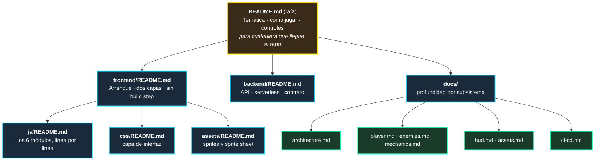
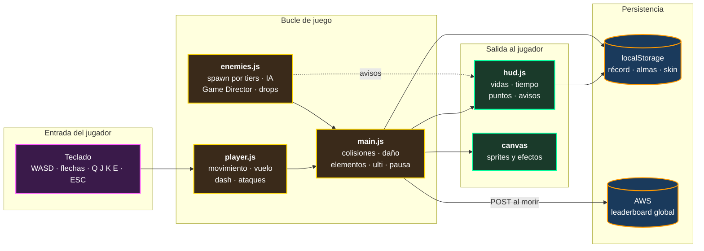

# `docs/` — Documentación técnica

> Los documentos de profundidad, uno por subsistema. Aquí se explica **cómo está construido** el juego; en los READMEs de cada carpeta se explica **por qué está construido así**.

[← Volver al README principal](../README.md) · [Jugar](https://main.d5hw5vsttp0x1.amplifyapp.com)

---

## Cómo navegar la documentación

El proyecto tiene dos niveles de documentación que se complementan.

**Regla práctica:**

| Si quieres... | Ve a... |
|---|---|
| Jugar o entender de qué va el juego | [`README.md`](../README.md) raíz |
| Entender **por qué** un archivo existe y qué decisiones lo formaron | El `README.md` de su carpeta |
| Entender **cómo** funciona un subsistema en detalle | Los documentos de aquí |

---

## Índice

| Documento | Cubre | Léelo si... |
|---|---|---|
| [`architecture.md`](architecture.md) | Filosofía de diseño, separación de responsabilidades, la máquina de estados de escenas y el sistema de pausa absoluta | Es tu primer contacto con el código y quieres el mapa general |
| [`player.md`](player.md) | El controlador del avatar: locomoción, sprint, vuelo, dash espectral, los dos ataques, la ulti y las mutaciones de color | Vas a tocar `player.js` o ajustar el *game feel* |
| [`enemies.md`](enemies.md) | El Game Director, la curva de progresión, los tres tiers de amenaza, el sistema de alertas y el knockback | Vas a balancear la dificultad o agregar un enemigo |
| [`mechanics.md`](mechanics.md) | Los tres subsistemas avanzados: economía y El Altar, orbes elementales y la Luna de Sangre | Vas a tocar la progresión o el combate elemental |
| [`hud.md`](hud.md) | La interfaz, la gestión del DOM, el algoritmo de puntuación y la persistencia del récord | Vas a modificar el HUD o el sistema de puntos |
| [`assets.md`](assets.md) | Carga centralizada de recursos y el mapeo de la hoja de sprites 6×6 | Vas a agregar sprites, animaciones o sonido |
| [`ci-cd.md`](ci-cd.md) | Topología cloud, el pipeline de despliegue en AWS Amplify y el endpoint de producción | Vas a desplegar, romper el build o mover la infraestructura |

---

## El sistema completo de un vistazo

---

## Estado de la documentación

Todos los documentos de esta carpeta reflejan el código en `main` a la fecha de la última revisión. Los puntos donde documentación y código **no** coinciden están señalados explícitamente en lugar de omitirse:

| Desfase conocido | Dónde |
|---|---|
| `ci-cd.md` describe un `amplify.yml`, pero ese archivo **no está versionado** en el repo — la configuración vive en la consola de Amplify | [`ci-cd.md`](ci-cd.md) §4 |
| El código de la Lambda de producción **no está en el repositorio**; `backend/server.js` es la implementación de referencia local | [`backend/README.md`](../backend/README.md#lo-primero-que-hay-que-entender-hay-dos-backends) |
| `audio.js` está completo pero **desconectado**: faltan los archivos de sonido | [`frontend/js/README.md`](../frontend/js/README.md#audiojs--el-sonido-en-espera) |
| Los enemigos se dibujan con primitivas geométricas; aún no tienen sprites | [`frontend/assets/README.md`](../frontend/assets/README.md#los-enemigos-no-tienen-sprites-todavía) |

---

## Al escribir documentación nueva

1. **Un documento por subsistema**, no por archivo. Si un subsistema cruza varios archivos (como la pausa absoluta), se documenta completo en un solo lugar.
2. **Explicar el porqué, no solo el qué.** El código ya dice qué hace; la documentación existe para decir por qué se decidió así y qué se descartó.
3. **Marcar los desfases en vez de ocultarlos.** Una sección honesta sobre lo que falta vale más que una que finge que está todo terminado.
4. **En español**, como el resto del proyecto.
5. **Diagramas en Mermaid**, no en ASCII: GitHub los renderiza nativamente y se mantienen legibles al editarlos.
