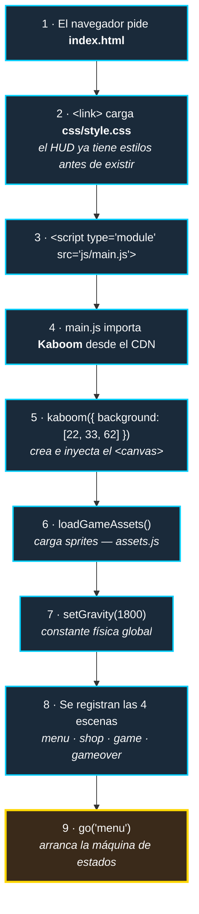
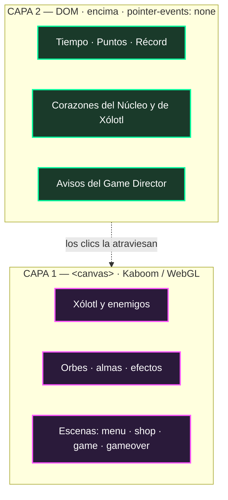

# `frontend/` — El juego completo

> Todo lo que el jugador ve, oye y toca vive aquí. Esta carpeta **es** el artefacto de despliegue: se sube tal cual a AWS Amplify, sin compilar nada.

[← Volver al README principal](../README.md) · [Jugar](https://main.d5hw5vsttp0x1.amplifyapp.com)

---

## Qué hay aquí

```
frontend/
├── index.html      ← punto de entrada: esqueleto DOM + capa del HUD
├── css/            → estilos del HUD y la capa de interfaz
├── js/             → toda la lógica del juego (5 módulos activos + 1 en espera)
└── assets/         → sprites y recursos gráficos
```

---

## Por qué esta carpeta existe separada

El repositorio contiene dos cosas muy distintas: un **juego que corre en el navegador** y una **API que corre en un servidor**. Mezclarlas en la raíz habría significado que el pipeline de despliegue tuviera que filtrar `server.js`, `Dockerfile`, `package.json` y `node_modules` antes de publicar.

Con la separación, el manifiesto de Amplify se reduce a una línea:

```yaml
artifacts:
  baseDirectory: frontend
  files:
    - '**/**'
```

**Todo lo que está en `frontend/` se publica. Nada más se publica.** Sin listas de exclusión, sin sorpresas.

---

## Por qué no hay build step

Esta es la decisión de arquitectura más importante del proyecto, y fue deliberada.

**No hay Webpack. No hay Vite. No hay Babel. No hay `npm install`.**

```js
// frontend/js/main.js — línea 1
import kaboom from "https://unpkg.com/kaboom@3000.0.1/dist/kaboom.mjs";
```

El motor se importa **directamente desde un CDN**, y los módulos propios usan `import`/`export` nativos de ES6. El navegador es el runtime completo.

### Lo que ganamos

| Ventaja | Impacto real |
|---|---|
| **Deploy = copiar archivos** | El CI/CD no ejecuta comandos: `commands: []`. Publica en segundos |
| **Cero fricción para el equipo** | Clonar y levantar un servidor estático. Nadie pelea con dependencias |
| **Sin deuda de tooling** | No hay `package-lock` que se rompa, ni versiones de Node que choquen |
| **Debug directo** | Lo que ves en DevTools es exactamente el código que escribiste. Sin source maps |
| **Carga instantánea** | Sin bundle de 2MB. El navegador cachea Kaboom desde el CDN |

### Lo que aceptamos a cambio

- Dependemos de que `unpkg.com` esté arriba (mitigado: Kaboom queda en la caché del navegador)
- Sin minificación ni tree-shaking (irrelevante: el código propio son ~1,200 líneas)
- Sin TypeScript ni transpilación (aceptado: el equipo escribe JS moderno y los navegadores objetivo lo soportan)

Para un proyecto de hackathon con un equipo pequeño y un juego de este tamaño, **el build step habría costado más de lo que aporta**.

---

## Cómo arranca el juego

El orden importa. Esta es la cadena exacta desde que el navegador pide la página:



**Detalle clave:** Kaboom crea su propio `<canvas>` y lo inyecta en el `<body>`. Por eso `index.html` no declara ningún `<canvas>` — solo declara la **capa de HUD en DOM** que se dibuja *encima*.

---

## La arquitectura de dos capas

Esta es la idea que sostiene toda la interfaz del juego:



**El HUD es HTML normal, no está dibujado dentro del canvas.**

### ¿Por qué?

| Razón | Explicación |
|---|---|
| **Texto nítido** | El texto del DOM usa el renderizador de fuentes del sistema. Dentro del canvas se vería pixelado o costaría cargar tipografías bitmap |
| **Cero costo de render** | Actualizar `elPuntos.innerText` no toca el bucle de dibujo. El canvas mantiene sus 60 FPS sin saber que el HUD existe |
| **CSS gratis** | Transiciones, sombras y centrado con `transform` salen de una línea de CSS. Reimplementarlas en el canvas sería trabajo manual |
| **Aislamiento total** | `hud.js` es **el único archivo autorizado a tocar el DOM**. Ningún otro módulo llama a `document.*` |

### El truco que lo hace funcionar

```css
#hud {
    position: fixed;
    inset: 0;              /* cubre toda la pantalla */
    pointer-events: none;  /* ← esto es lo esencial */
}
```

Sin `pointer-events: none`, la capa del HUD interceptaría **todos** los clics y los botones del menú y de la tienda dejarían de responder. Con esa línea, el HUD es visualmente sólido pero **transparente al mouse**: los clics lo atraviesan y llegan al canvas.

---

## `index.html` — el contrato con `hud.js`

El HTML es intencionalmente mínimo (37 líneas). Su único trabajo real es declarar los **anclas del HUD**:

```html
<div id="hud">
    <div id="hud-marcador">
        <span class="hud-dato">Tiempo <b id="hud-tiempo">00:00</b></span>
        <span class="hud-dato">Puntos <b id="hud-puntos">0</b></span>
        <span class="hud-dato hud-record">Record <b id="hud-record">0</b></span>
    </div>
    <div id="hud-vidas">
        <span class="nucleo-hp">Nucleo <b id="hud-vida-nucleo"></b></span>
        <span class="fantasma-hp">Xolotl <b id="hud-vida-jugador"></b></span>
    </div>
    <div id="hud-aviso"></div>
</div>
```

Estos IDs son un **contrato duro**: `js/hud.js` los busca por nombre con `getElementById`. Renombrar uno rompe el HUD en silencio, sin lanzar error visible en la consola del juego.

| ID | Lo llena | Contenido |
|---|---|---|
| `hud-tiempo` | `hud.js` cada frame | Cronómetro `MM:SS` |
| `hud-puntos` | `hud.js` al puntuar | Puntaje actual |
| `hud-record` | `hud.js` al iniciar | Récord leído de `localStorage` |
| `hud-vida-nucleo` | `hud.js` al recibir daño | `♥♥♥♡♡` dorados |
| `hud-vida-jugador` | `hud.js` al recibir daño | `♥♥♡` cian |
| `hud-aviso` | `hud.js` en eventos | Aviso central temporal |
| `hud-energia-relleno` | `hud.js` al sumar/gastar energía | Ancho en % de la barra de la Ulti |
| `hud-energia-valor` | `hud.js` al sumar/gastar energía | Porcentaje en texto |

La barra de la Ulti tiene estructura propia porque necesita un relleno que crezca por dentro:

```html
<div id="hud-energia">
    <span class="energia-etiqueta">Ulti</span>
    <div class="energia-barra">
        <div id="hud-energia-relleno"></div>
    </div>
    <b id="hud-energia-valor">0%</b>
</div>
```

`hud.js` solo cambia el `width` del relleno y pone o quita la clase `.lista` en el contenedor; el crecimiento y el latido dorado los anima CSS.

---

## Compatibilidad

| Requisito | Por qué |
|---|---|
| Navegador con **ES6 Modules** | Los `import`/`export` nativos. Chrome 61+, Firefox 60+, Safari 11+ |
| **WebGL** | Kaboom renderiza sobre WebGL |
| **`localStorage`** | Para récord, almas y skin. *Degrada elegantemente*: todo está envuelto en `try/catch`, así que en modo incógnito o con cookies bloqueadas el juego **sigue funcionando**, solo no persiste entre sesiones |
| **Servidor HTTP** | Abrir `index.html` con `file://` falla: el navegador bloquea módulos ES6 por política CORS |

---

## Correrlo en local

```bash
cd frontend
python3 -m http.server 8000    # o: npx serve
```

→ **http://localhost:8000**

No hay dependencias que instalar. No hay build que ejecutar.
