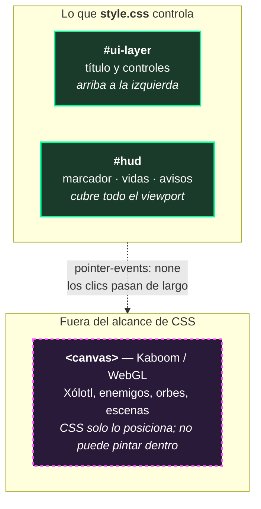

# `frontend/css/` — Estilos y capa de interfaz

> 126 líneas de CSS. Todo lo que se ve **fuera** del canvas.

[← Volver a frontend](../README.md) · [← README principal](../../README.md)

---

## Qué hay aquí

```
css/
└── style.css    126 líneas · único archivo de estilos del proyecto
```

Un solo archivo, sin preprocesadores, sin frameworks, sin PostCSS. Coherente con la decisión de [cero build step](../README.md#por-qué-no-hay-build-step) del proyecto.

---

## Qué estiliza y qué no

Este archivo **no dibuja nada del juego**. Xólotl, los enemigos, los orbes y los efectos viven dentro del `<canvas>` de Kaboom, que es una superficie de píxeles inaccesible para CSS.

Lo que sí controla es **la capa de HTML que flota encima del canvas**:



Ver [la arquitectura de dos capas](../README.md#la-arquitectura-de-dos-capas) para el porqué de esta separación.

---

## Las cuatro decisiones que importan

### 1. `overflow: hidden` en el `body`

```css
body {
    margin: 0;
    padding: 0;
    background-color: #1a1a2e;
    overflow: hidden;
    font-family: sans-serif;
}
```

Kaboom dimensiona su canvas al viewport. Sin `overflow: hidden`, cualquier redondeo de un píxel provocaría **barras de scroll** que rompen la sensación de pantalla completa y desplazan el juego al usar las flechas. Con esta línea, el juego queda anclado.

El `margin: 0` es igual de necesario: los 8px por defecto del navegador empujarían el canvas y descuadrarían el HUD respecto a lo que se dibuja debajo.

El `background-color: #1a1a2e` es un azul noche que **coincide con el color de fondo de Kaboom** (`kaboom({ background: [22, 33, 62] })`). Si el canvas tarda un instante en aparecer o no cubre exactamente el viewport, el hueco es del mismo color y nadie lo nota.

### 2. `pointer-events: none` en las dos capas

La línea más importante de todo el archivo:

```css
#hud {
    position: fixed;
    inset: 0;              /* cubre TODA la pantalla */
    pointer-events: none;  /* ← sin esto, el juego es injugable */
    color: white;
    text-shadow: 2px 2px 0px #000;
    display: none;         /* oculto hasta que empieza la partida */
}
```

El `display: none` inicial existe porque el HUD es DOM: sin él se veía en el menú y en la tienda, encimado con el título y los créditos. `js/hud.js` lo muestra con `mostrar()` al arrancar la partida y lo vuelve a ocultar con `ocultar()` en el Game Over.

`#hud` cubre el viewport completo para poder posicionar sus elementos en las esquinas. Pero un elemento que cubre toda la pantalla **intercepta todos los clics** por defecto.

Sin `pointer-events: none`, los botones **INICIAR RETO**, **EL ALTAR**, las tarjetas de skins y **REGRESAR** dejarían de responder — todos viven dentro del canvas, debajo del HUD. El juego arrancaría en el menú y no habría forma de salir de ahí.

Con esa línea, la capa es **visualmente sólida pero transparente al mouse**: los clics la atraviesan y llegan a Kaboom. Lo mismo aplica a `#ui-layer`.

### 3. `text-shadow` en vez de contornos

```css
text-shadow: 2px 2px 0px #000;
```

Aplicado al `#hud` completo y heredado por todos sus hijos. El fondo del juego es una imagen con zonas claras y oscuras, y **se tiñe de rojo durante la Luna de Sangre**. Texto blanco plano sobre un fondo cambiante se vuelve ilegible en el peor momento posible.

La sombra dura sin desenfoque (`0px` de blur) recorta cada carácter contra lo que tenga detrás, sea lo que sea. Se lee como texto de videojuego retro **y** resuelve un problema real de contraste. No es decoración.

### 4. La animación del aviso vive en CSS, no en JS

```css
#hud-aviso {
    position: absolute;
    top: 32%;
    left: 50%;
    transform: translateX(-50%);
    font-size: 30px;
    font-weight: bold;
    text-transform: uppercase;
    letter-spacing: 3px;
    color: #ff5555;
    white-space: nowrap;
    opacity: 0;                      /* invisible mientras no haya nada que decir */
    transition: opacity 0.4s ease;   /* js/hud.js solo pone y quita .visible */
}

#hud-aviso.visible {
    opacity: 1;
}
```

**Este es el patrón central de la relación entre CSS y JS en el proyecto.** `hud.js` no calcula opacidad, no corre un temporizador de fade, no toca `style`. Solo hace:

```js
elAviso.classList.add("visible");     // aparece
elAviso.classList.remove("visible");  // se desvanece
```

El navegador se encarga de los 0.4 segundos de transición, **en el hilo de composición**, sin gastar un solo ciclo del bucle de juego. Reimplementar ese fade en JavaScript significaría interpolar opacidad cada frame dentro de un `onUpdate` que compite con el renderizado del canvas.

El `white-space: nowrap` evita que un aviso largo como `"¡ALERTA ROJA: MINIJEFES ACERCÁNDOSE!"` se parta en dos líneas y descuadre el centrado vertical.

---

## Mapa de zonas

| Selector | Posición | Contenido |
|---|---|---|
| `#ui-layer` | Arriba izquierda, `absolute` | Título del juego y recordatorio de controles |
| `#hud-marcador` | Arriba centro, `absolute` + `translateX(-50%)` | Tiempo · Puntos · Récord |
| `#hud-vidas` | Arriba derecha, `absolute` | Corazones del Núcleo y de Xólotl |
| `#hud-aviso` | Centro (32% de altura) | Avisos temporales del Game Director |

### El centrado real

```css
#hud-marcador {
    position: absolute;
    top: 20px;
    left: 50%;
    transform: translateX(-50%);   /* ← así queda centrado de verdad */
    display: flex;
    gap: 26px;
}
```

`left: 50%` alinea el **borde izquierdo** del contenedor al centro, no el contenedor. El `translateX(-50%)` lo corre hacia atrás la mitad de su propio ancho.

Esto importa aquí más que en un layout normal: el marcador **cambia de ancho constantemente** conforme el puntaje pasa de `0` a `1234`. Con `margin: auto` o un ancho fijo, el bloque saltaría lateralmente cada vez que el puntaje ganara un dígito. Con `transform`, se mantiene centrado a cualquier ancho.

El `gap: 26px` del flexbox separa los tres datos sin márgenes manuales ni elementos separadores.

---

## El código de colores

Los colores del HTML **espejean** los del canvas. Es un contrato visual, no coincidencia:

```css
.hud-record b  { color: #ffd700; }   /* dorado: como el Núcleo */
.nucleo-hp b   { color: #ffd700; }   /* dorado: es el Núcleo */
.fantasma-hp b { color: #00ffff; }   /* cian: es Xólotl */
#hud-aviso     { color: #ff5555; }   /* rojo: alerta */
p              { color: #0ff;     }  /* cian: texto de controles */
```

| Color | Hex | Significado en todo el juego |
|---|---|---|
| **Dorado** | `#ffd700` | El Núcleo Sagrado, las almas, el récord. Lo que hay que proteger y conseguir |
| **Cian** | `#00ffff` | Xólotl y lo espiritual: sus vidas, las partículas del menú, el destello de la ulti |
| **Rojo** | `#ff5555` | Peligro: avisos, alertas de spawn, la Luna de Sangre |

Cuando el jugador ve corazones dorados en el HTML, ya asoció ese dorado con el pilar que está en medio del canvas. **La interfaz y el juego hablan el mismo idioma cromático aunque los dibujen dos motores distintos.**

---

## La jerarquía tipográfica

```css
.hud-dato {
    font-size: 13px;          /* etiqueta: pequeña y gris */
    text-transform: uppercase;
    letter-spacing: 1px;
    color: #aaa;
}
.hud-dato b {
    font-size: 22px;          /* valor: grande y blanco */
    margin-left: 6px;
    color: #fff;
}
```

Las **etiquetas** (`Tiempo`, `Puntos`, `Record`) van chicas, grises y en mayúsculas: son contexto estático que se lee una vez. Los **valores** van grandes y blancos: son lo que cambia y lo que hay que poder leer de reojo a mitad de una horda.

Los corazones son aún más grandes (`font-size: 24px` con `letter-spacing: 2px`) porque son la información más crítica de la pantalla. El espaciado extra separa los `♥♥♥♡♡` para que se cuenten de un vistazo en lugar de leerse como una mancha.

```css
#hud-vidas > span {
    display: block;    /* una línea para el Núcleo y otra para Xólotl */
    margin-bottom: 4px;
}
```

El `display: block` en los `<span>` fuerza una línea por cada barra de vida. Sin él, ambas quedarían en la misma fila y sería fácil confundir de quién es cada corazón bajo presión.

---

## Por qué CSS plano y no Tailwind, Sass o CSS-in-JS

| Alternativa | Por qué no |
|---|---|
| **Tailwind** | Requiere build step y un binario que vigile los archivos. Rompe el deploy de "copiar y listo". Además el HTML son 37 líneas: no hay suficiente marcado para que las clases utilitarias ahorren nada |
| **Sass / Less** | Un paso de compilación para 126 líneas sin anidamiento profundo ni mixins. El costo de tooling supera el beneficio |
| **CSS-in-JS** | Acoplaría los estilos a la lógica del juego. Peor: los estilos llegarían **después** de que el JS se ejecute, provocando un parpadeo del HUD sin estilo al arrancar |
| **CSS plano** | Se carga en el `<head>`, antes de que exista el canvas. El HUD nunca aparece sin estilo. Cero dependencias |

---

## Al agregar estilos nuevos

1. **Cualquier capa que cubra la pantalla necesita `pointer-events: none`** o romperá los clics del juego.
2. **Usar `transform: translateX(-50%)` para centrar**, no anchos fijos: el contenido cambia de tamaño en runtime.
3. **Preferir transiciones de CSS sobre animación en JS.** El bucle de juego ya compite por el frame; el compositor del navegador no.
4. **Respetar el código de colores** (dorado / cian / rojo). No introducir un cuarto color sin un significado nuevo detrás.
5. **Todo lo que se dibuje dentro del canvas se estiliza en JS**, no aquí. CSS no alcanza ahí.

### La barra de la Ulti

`#hud-energia` vive arriba al centro, justo debajo del marcador. **Abajo al centro no era opción**: ahí están parados el Núcleo y Xólotl, y la barra les quedaba encima.

Sigue el mismo patrón que el aviso: **JS solo cambia un ancho y una clase, CSS hace la animación.**

```css
#hud-energia-relleno {
    width: 0%;                     /* lo unico que toca js/hud.js */
    background: #00ffff;
    transition: width 0.25s ease;  /* la subida la anima el navegador */
}

/* Al llegar a 100% se vuelve dorada y late: la ulti ya se puede usar */
#hud-energia.lista #hud-energia-relleno {
    background: #ffd700;
    animation: latido-ulti 0.8s ease-in-out infinite;
}
```

Dos detalles que importan:

- **`overflow: hidden` en `.energia-barra`** — sin él, el relleno se sale de las esquinas redondeadas del contenedor y la barra se ve rota en los extremos.
- **`min-width: 46px` en el valor** — el texto pasa de `0%` a `100%` y cambia de ancho. Sin el mínimo, la barra brinca lateralmente cada vez que el porcentaje gana un dígito.

El cambio de cian a dorado no es decorativo: reusa el código de colores del proyecto, donde el dorado siempre significa *esto es valioso, úsalo*.
