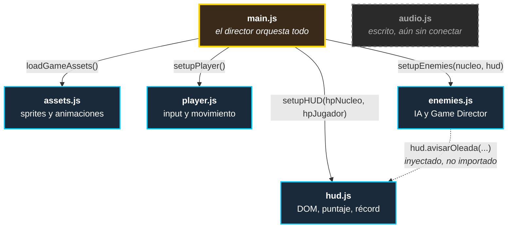
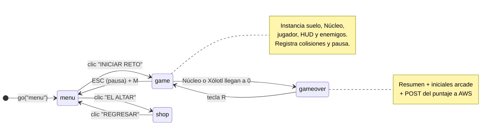

# `frontend/js/` — La lógica del juego

> Cinco módulos activos, un módulo en espera, ~1,200 líneas. Cada archivo tiene **una sola responsabilidad** y una frontera clara con los demás.

[← Volver a frontend](../README.md) · [← README principal](../../README.md)

---

## Mapa de archivos

| Archivo | Líneas | Responsabilidad única |
|---|---|---|
| [`main.js`](#mainjs--el-director) | 499 | **Director.** Escenas, colisiones globales, economía, pausa, ulti |
| [`player.js`](#playerjs--el-avatar) | 168 | **Avatar.** Input, movimiento, vuelo, dash, ataques |
| [`enemies.js`](#enemiesjs--la-horda) | 247 | **Horda.** Fábricas de enemigos, IA, Game Director, drops |
| [`hud.js`](#hudjs--la-interfaz) | 165 | **Interfaz.** Único módulo que toca el DOM. Puntaje y récord |
| [`assets.js`](#assetsjs--los-recursos) | 39 | **Recursos.** Carga de sprites y mapeo de animaciones |
| [`audio.js`](#audiojs--el-sonido-en-espera) | 58 | **Sonido.** Escrito y listo, aún no conectado |

---

## Cómo se conectan



Las dependencias son **explícitas por inyección**, no globales:

```js
// main.js — escena "game"
const player = setupPlayer();
const hud    = setupHUD(nucleo.hp, player.hp);
const enemiesSystem = setupEnemies(nucleo, hud);   // ← recibe lo que necesita
```

`enemies.js` **no importa** `hud.js`. Recibe la instancia por parámetro. Esto significa que se puede probar el sistema de enemigos pasándole un HUD falso, y que el grafo de imports no tiene ciclos.

### El patrón: fábricas con clausura

Ninguno de los módulos exporta clases ni objetos globales. Todos exportan una **función `setup*()` que se ejecuta una vez por partida** y devuelve solo su API pública:

```js
export function setupHUD(hpNucleoMax, hpJugadorMax) {
    let puntos = 0;      // ← privado, inaccesible desde fuera
    let energia = 0;     // ← privado

    function sumarPuntos(cantidad) { /* ... */ }

    return { sumarPuntos, cargarEnergia, gastarEnergia, /* ... */ };
}
```

**Por qué:** el estado vive en la clausura, así que es imposible que `main.js` corrompa `puntos` por accidente. Y como todo se crea dentro de `scene("game", ...)`, cada partida arranca con estado **completamente limpio** — no hay que acordarse de resetear nada al reiniciar. Presionar `R` en el Game Over recrea todo desde cero.

---

## `main.js` — El director

El archivo más grande. Contiene las 4 escenas y todas las reglas que cruzan sistemas.

### Las 4 escenas

Kaboom implementa una **máquina de estados finitos**. Solo una escena vive a la vez; `go("nombre")` destruye la anterior por completo.



| Escena | Qué hace |
|---|---|
| **`menu`** | Partículas cian ascendentes generadas en bucle (`loop(0.1)`), Xólotl flotando con interpolación senoidal (`wave`), título que pulsa de escala y color. Botones a partida y tienda |
| **`game`** | El núcleo. Instancia suelo, Núcleo, jugador, HUD y enemigos; registra las colisiones y el sistema de pausa |
| **`shop`** | El Altar. Renderiza las 3 skins, valida saldo y persiste la elección |
| **`gameover`** | Resumen de partida + registro de iniciales arcade + envío a la API de AWS |

### El sistema de economía

Las tres funciones de almas viven aquí porque son **transversales**: la tienda las lee, el gameplay las escribe.

```js
const CLAVE_MONEDAS = "xolotl_monedas_demo";
const CLAVE_SKIN    = "xolotl_skin_activa";

function getMonedas()             { /* lee localStorage */ }
function sumarMonedas(cantidad)   { /* suma y persiste */ }
function gastarMonedas(cantidad)  { /* valida saldo, cobra, devuelve bool */ }
```

**Todas envueltas en `try/catch`.** Si `localStorage` no está disponible (modo incógnito, cookies bloqueadas, iframe restringido), devuelven `0` o `false` en vez de reventar. El juego **sigue siendo jugable sin persistencia** — degrada, no falla.

`gastarMonedas` devuelve un booleano y esa es la validación completa de la compra:

```js
if (skin.costo === 0 || gastarMonedas(skin.costo)) {
    localStorage.setItem(CLAVE_SKIN, skin.id);
    go("shop");        // recarga la escena para refrescar el estado visual
} else {
    shake(4);          // feedback háptico: no te alcanza
}
```

Recargar la escena en vez de mutar los elementos uno por uno es más simple y **imposible de dejar desincronizado**.

### Las colisiones globales

Aquí es donde se define casi todo el "juego". Cinco reglas gobiernan el combate entero:

| Colisión | Qué pasa |
|---|---|
| `sword_hitbox` × `enemy` | 2 de daño (4 con Fuego). Con Rayo, encadena 2 a todo enemigo en 100px |
| `laser` × `enemy` | 1 de daño (2 con Fuego). Con Hielo, baja la velocidad del enemigo a 30% por 3s. El láser se destruye |
| `enemy` × `nucleo` | El enemigo muere, el Núcleo pierde 1 vida (**3 si es jefe**), shake + parpadeo rojo |
| `enemy` × `player` | El enemigo muere, Xólotl pierde 1 vida. **Ignorado si `p.isDashing`** ← así el dash da invulnerabilidad |
| `player` × `coin` | Recoge el alma y suma a `localStorage` |
| `player` × `powerup` | Aplica el elemento por 12 segundos |

**La invulnerabilidad del dash es una sola condición:**

```js
onCollide("enemy", "player", (enemy, p) => {
    if (enemy.isSpawning || p.isDashing) return;   // ← aquí
    // ...
});
```

No hay sistema de frames de invencibilidad ni capas de colisión que activar. Una bandera booleana que `player.js` levanta durante 0.2 segundos.

**`isSpawning` resuelve un bug sutil:** los enemigos terrestres nacen con una animación de escala (`scale(tamano, 0.1)` creciendo a tamaño real en 0.8s). Durante esa animación su hitbox ya existe. Sin la bandera, un enemigo podría dañar al Núcleo *mientras todavía está brotando del suelo*, lo cual se siente injusto y arbitrario. La bandera lo hace **intangible hasta que termina de emerger**.

### El daño con feedback: `golpearEnemigo`

```js
function golpearEnemigo(enemy, danio) {
    if (enemy.isSpawning) return;
    enemy.hp -= danio;

    const colorOriginal = enemy.color;
    enemy.color = rgb(255, 255, 255);                  // ← flash blanco
    wait(0.1, () => { if (enemy.exists()) enemy.color = colorOriginal; });

    if (enemy.tier !== 3) {                            // los jefes no retroceden
        enemy.isKnockedBack = true;
        const direccionAlejamiento = enemy.pos.sub(centroNucleo).unit();
        tween(enemy.pos, enemy.pos.add(direccionAlejamiento.scale(40)), 0.15,
              (p) => enemy.pos = p, easings.easeOutQuad)
            .onEnd(() => { if (enemy.exists()) enemy.isKnockedBack = false; });
    }

    if (enemy.hp <= 0) matarEnemigo(enemy);
}
```

Tres detalles que importan:

1. **El flash blanco de 0.1s** es lo que hace que golpear se *sienta*. Sin él, pegarle a un enemigo de 15 HP no da ninguna señal de que estás avanzando.
2. **`if (enemy.exists())`** antes de tocar el enemigo en callbacks diferidos. Sin esa guarda, si el enemigo muere durante los 0.1s de espera, el callback intentaría escribir en un objeto destruido.
3. **El knockback empuja *desde el Núcleo*, no desde el jugador.** Es intencional: siempre aleja la amenaza de lo que defiendes, sin importar desde dónde ataques. Empujar desde el jugador te dejaría empujando enemigos *hacia* el Núcleo si atacas desde el lado equivocado.

### La Ulti Espiritual

```js
onKeyPress("e", () => {
    if (!hud.gastarEnergia()) {                    // ← el HUD valida y cobra
        hud.avisarOleada("¡Energía insuficiente!");
        return;
    }
    shake(24);                                     // sacudida fuerte
    add([rect(width(), height()), color(0, 255, 255), opacity(0.8),
         lifespan(0.3, { fade: 0.3 })]);           // destello cian

    const onda = add([circle(10), pos(centroOnda), color(255, 215, 0), /* ... */]);
    tween(10, Math.max(width(), height()) * 1.5, 0.4,
          (r) => onda.radius = r, easings.easeOutQuad).onEnd(() => destroy(onda));

    get("enemy").forEach((enemy) => {
        if (enemy.isSpawning) return;
        if (enemy.tier === 3) golpearEnemigo(enemy, 8);   // jefes: 8 de daño
        else matarEnemigo(enemy);                          // el resto: muerte
    });
});
```

**Diseño:** `hud.gastarEnergia()` valida **y** cobra en la misma llamada, devolviendo un booleano. Es imposible gastar energía sin lanzar la ulti, o lanzarla sin gastarla.

Los jefes reciben daño en vez de morir para que la ulti **no trivialice** los encuentros de Tier 3. Con 15 HP, un jefe terrestre necesita dos ultis completas o combate directo.

La onda expansiva es puramente cosmética — el daño se aplica instantáneamente al presionar la tecla. El `tween` con `easeOutQuad` solo comunica visualmente lo que ya ocurrió.

### La pausa absoluta

El sistema más transversal del proyecto:

```js
let pausado = false;
onKeyPress("escape", () => {
    pausado = !pausado;
    window.juegoPausado = pausado;    // ← bandera global
    // ...renderiza u oculta la capa "pause-ui"
});
```

**`window.juegoPausado` es la única variable global del proyecto, y es a propósito.**

La alternativa habría sido pasar una referencia al estado de pausa a cada uno de los 5 módulos, y que cada uno la propague a sus callbacks internos. Con la bandera global, cada bucle se protege con una sola línea:

```js
onUpdate(() => {
    if (window.juegoPausado) return;
    // ...
});
```

Está aplicada en **todos** los puntos que avanzan estado:

| Módulo | Qué congela |
|---|---|
| `main.js` | Tinte de la Luna de Sangre, recogida de monedas y orbes, la ulti |
| `player.js` | Movimiento, vuelo, dash, ambos ataques, límites de pantalla |
| `enemies.js` | IA de movimiento, el bucle del Game Director, planificación de spawns, flotado de orbes |
| `hud.js` | El cronómetro y los puntos por segundo |

El caso más delicado es el planificador de spawns, porque es recursivo:

```js
wait(tiempoEspera, () => {
    if (window.juegoPausado) {
        planearProximoSpawn();    // ← se reprograma, NO spawnea
        return;
    }
    // ...spawnea y continúa
});
```

Si simplemente hiciera `return`, la cadena de spawns **se rompería para siempre** y no volverían a aparecer enemigos al despausar. Reprogramarse mantiene el ciclo vivo mientras el juego está congelado.

### Los orbes elementales

```js
player.elemento = "normal";
let temporizadorElemento = null;

function aplicarElemento(nuevoElemento) {
    player.elemento = nuevoElemento;
    // ...cambia player.color según el elemento

    clearTimeout(temporizadorElemento);        // ← cancela el anterior
    temporizadorElemento = setTimeout(() => {
        player.elemento = "normal";
        // ...restaura el color de la SKIN, no blanco genérico
    }, 12000);
}
```

**El `clearTimeout` es esencial:** sin él, recoger un segundo orbe a los 10 segundos del primero dejaría el temporizador viejo vivo, y a los 2 segundos te quitaría el elemento nuevo. Con el cancelado, cada orbe **reinicia limpiamente** la ventana de 12 segundos.

Al expirar, el color vuelve al de tu **skin equipada** (verde si tienes Serpiente Emplumada, magenta si tienes Calavera del Mictlán), no a blanco. Un detalle pequeño que evita que el sistema de elementos borre visualmente tu compra de la tienda.

### El envío del puntaje

La escena `gameover` implementa registro de iniciales estilo arcade y las envía a AWS:

```js
onKeyPress("enter", async () => {
    if (scoreGuardado) return;        // ← anti doble envío
    scoreGuardado = true;

    try {
        await fetch("https://k572xn1fxj.execute-api.us-east-2.amazonaws.com/default/XolotlApi", {
            method: "POST",
            headers: { "Content-Type": "application/json" },
            body: JSON.stringify({ nombre: iniciales, puntos: resumen.puntos, tiempo: resumen.tiempo })
        });
        txtIniciales.text = "¡GUARDADO EN EL BACKEND! (Presiona R para reiniciar)";
    } catch (error) {
        txtIniciales.text = "ERROR DE CONEXIÓN CON EL SERVIDOR";
    }
});
```

La bandera `scoreGuardado` bloquea envíos duplicados por martilleo de `ENTER`. El `try/catch` garantiza que **una caída de la API no impida seguir jugando** — se muestra el error y `R` sigue funcionando.

> El endpoint está escrito directamente en el código. Para un despliegue estático sin build step no hay mecanismo de variables de entorno, y el endpoint es público por diseño (no lleva credenciales). Ver [`backend/README.md`](../../backend/README.md).

---

## `player.js` — El avatar

Encapsula **todo** el input del jugador. Ningún otro módulo lee el teclado para controlar a Xólotl.

### Constantes

```js
const VEL_NORMAL = 300;      const VEL_DASH = 1200;
const VEL_CORRER = 600;      const COOLDOWN_ATAQUE = 0.25;
const VEL_LASER  = 900;
```

Todo el *game feel* está en estos cinco números. Ajustar el ritmo del juego es cambiar una línea, no rastrear valores mágicos por el archivo.

### El sistema de vuelo

La mecánica de movimiento más distintiva — estilo Kirby:

```js
onKeyPress("space", () => {
    if (player.isGrounded()) {
        player.jump(700);              // primer SPACE: salto normal
    } else if (!player.isFlying) {
        player.isFlying = true;
        player.gravityScale = 0;       // ← anula la gravedad
        player.jump(0.1);              // impulso mínimo: despega del estado "cayendo"
    }
});

player.onGround(() => {
    player.isFlying = false;
    player.gravityScale = 1;           // ← aterrizar lo desactiva solo
});
```

**Cómo funciona:** el segundo `SPACE` en el aire pone `gravityScale = 0`, así que Xólotl deja de caer y queda suspendido. A partir de ahí, `W`/`S` mueven en vertical libremente. El `jump(0.1)` es un truco: da un impulso casi imperceptible que saca al cuerpo del estado de caída del motor físico.

**El reset es automático.** `onGround()` es un evento de Kaboom que dispara al tocar suelo — no hay que acordarse de restaurar la gravedad manualmente en ningún lado. Tocar el piso limpia el estado.

### El Dash Espectral

```js
let puedeDashear = true;
onKeyPress("q", () => {
    if (!puedeDashear || player.isDashing) return;
    puedeDashear = false;
    player.isDashing = true;           // ← esto es lo que da invulnerabilidad
    player.opacity = 0.5;              // señal visual clara

    const impulso = player.direccion === 1 ? VEL_DASH : -VEL_DASH;
    const dashAnim = onUpdate(() => {
        if (window.juegoPausado) return;
        player.move(impulso, 0);
    });

    wait(0.2, () => {
        dashAnim.cancel();             // ← libera el handler
        player.isDashing = false;
        player.opacity = 1;
    });
    wait(1, () => { puedeDashear = true; });   // cooldown independiente
});
```

**Dos temporizadores separados a propósito:** el dash *dura* 0.2s pero *recarga* en 1s. Esa ventana de 0.8s de vulnerabilidad entre dashes es lo que impide encadenarlos y volverse invencible.

**`dashAnim.cancel()` es obligatorio.** `onUpdate()` devuelve un handler que corre indefinidamente. Sin cancelarlo, cada dash dejaría un bucle huérfano empujando a Xólotl para siempre, y el juego se volvería incontrolable después de tres o cuatro dashes.

La invulnerabilidad no está implementada aquí — está en `main.js`, que lee `p.isDashing` en la colisión. `player.js` solo levanta la bandera.

### Prioridad de animaciones

```js
function iniciarAnimacionCorrer() {
    if (player.curAnim() !== "walk"  && player.curAnim() !== "melee" &&
        player.curAnim() !== "shoot" && player.curAnim() !== "hit") {
        player.play("walk");
    }
}
```

Sin esta guarda, mantener `D` presionado reiniciaría la animación de caminar **cada frame**, congelándola en el primer cuadro. Y atacar mientras caminas cortaría el espadazo a la mitad.

La regla: **`melee`, `shoot` y `hit` tienen prioridad sobre el movimiento** y se dejan terminar. Al acabar, `onAnimEnd` devuelve a `idle`:

```js
player.onAnimEnd((anim) => {
    if (anim === "melee" || anim === "shoot" || anim === "hit") player.play("idle");
});
```

### Los dos ataques

| | Espada (`J`) | Láser (`K`) |
|---|---|---|
| **Cómo funciona** | Crea un `rect(50, 40)` con `area()` a 40px al frente, y lo destruye 0.1s después | Crea un `circle(10)` con `move()` a 900 de velocidad |
| **Daño base** | 2 | 1 |
| **Alcance** | 40px | Toda la pantalla |
| **Limpieza** | `wait(0.1, () => destroy(hitbox))` | `offscreen({ destroy: true })` |
| **Cooldown** | 0.25s (compartido) | 0.25s (compartido) |

**El cooldown es compartido** (`player.canAttack`), así que no puedes alternar `J` y `K` para atacar al doble de velocidad.

Ambos ataques verifican `if (!player.canAttack || player.isDashing) return` — **no puedes atacar mientras dasheas**, lo que evita que el dash sea una habilidad estrictamente superior.

El láser se limpia solo con `offscreen({ destroy: true })`: al salir del canvas se destruye. Sin eso, cada disparo acumularía un objeto vivo viajando al infinito y la memoria crecería sin límite durante una partida larga.

### Límites de pantalla

```js
onUpdate(() => {
    if (window.juegoPausado) return;
    if (player.pos.x < 20) player.pos.x = 20;
    if (player.pos.x > width() - 20) player.pos.x = width() - 20;
    if (player.pos.y < 20) player.pos.y = 20;
});
```

Clamp en X y en el techo. **No hay clamp inferior** — el suelo es un cuerpo físico estático que lo resuelve. Sin el clamp de X, el dash de 1200 de velocidad te sacaría del canvas en fracciones de segundo.

---

## `enemies.js` — La horda

Contiene las fábricas de enemigos, la IA, el sistema de drops y el **Game Director** que gobierna la dificultad.

### Fábricas por tier

Dos funciones generan las 6 variantes del bestiario:

```js
function spawnTerrestre(tier, saleDeIzquierda) {
    let vida = 3; let velMulti = 1; let tamano = 1;
    let colorEnemigo = rgb(150, 255, 150);

    if (tier === 2) { vida = 5;  velMulti = 1.5; colorEnemigo = rgb(255, 150, 50); }
    if (tier === 3) { vida = 15; velMulti = 0.5; tamano = 2.5; colorEnemigo = rgb(255, 50, 50); }
    // ...
}
```

| Tier | Terrestre | Aéreo |
|---|---|---|
| **1** | 3 HP · vel ×1 · verde | 1 HP · vel ×1.2 · rosa |
| **2** | 5 HP · vel ×1.5 · naranja | 2 HP · vel ×1.8 · morado, movimiento en zigzag |
| **3** | **15 HP** · vel ×0.5 · escala 2.5 · rojo | **12 HP** · vel ×0.6 · escala 2 · violeta |

**El patrón de los jefes es intencional:** mucha vida, poca velocidad, tamaño enorme. Son un **problema de recursos**, no de reflejos — te obligan a decidir si gastas la ulti, si guardas un orbe de Fuego, o si te arriesgas al cuerpo a cuerpo.

### La zona segura de spawn

```js
const ZONA_SEGURA = 200;

do { spawnX = rand(50, width() - 50); }
while (Math.abs(spawnX - (width() / 2)) < ZONA_SEGURA);
```

Los terrestres **no pueden aparecer a menos de 200px del Núcleo**. Sin este bucle, un enemigo podría materializarse pegado al pilar y quitarle una vida antes de que puedas reaccionar. Con la zona segura, **siempre tienes tiempo de interceptar**.

Los jefes y los aéreos ignoran la zona porque entran desde **fuera del canvas** (`-80` o `width() + 80`), lo cual ya garantiza distancia y hace que su entrada se lea como una invasión.

### La animación de emergencia

```js
const zombi = add([ /* ... */ scale(tamano, 0.1), { isSpawning: true } ]);

tween(0.1, tamano, 0.8, (val) => zombi.scale = vec2(tamano, val), easings.easeOutBack)
    .onEnd(() => { zombi.isSpawning = false; });
```

Los terrestres nacen aplastados (escala vertical `0.1`) y crecen a tamaño real en 0.8 segundos con `easeOutBack`, que da un rebote elástico al final. Se lee como si **brotaran del suelo**.

Durante toda esa animación, `isSpawning = true` los hace **inofensivos e inmunes**. Las colisiones y `golpearEnemigo` lo verifican. Sin la bandera, un enemigo aplastado y medio invisible ya podría dañar el Núcleo — se sentiría como un bug.

### La IA de movimiento

Un solo `onUpdate` maneja a todos los enemigos vivos:

```js
onUpdate("enemy", (e) => {
    if (window.juegoPausado) return;
    if (e.isSpawning || e.isKnockedBack) return;

    if (e.is("zombie")) {
        const dirX = Math.sign(nucleo.pos.x - e.pos.x);   // solo eje X
        e.move(dirX * e.velocidad, 0);
        if (e.tier === 3) shake(1);                       // los jefes hacen temblar

    } else if (e.is("aerial")) {
        const direccion = nucleo.pos.sub(e.pos).unit();   // vector completo
        e.move(direccion.scale(e.velocidad));
        if (e.tier === 2) e.move(0, wave(-200, 200, time() * 10));  // zigzag
    }
});
```

**Terrestres vs aéreos:**
- Los terrestres usan `Math.sign()` sobre el eje X: caminan hacia el Núcleo en línea recta y la gravedad los mantiene pegados al piso.
- Los aéreos usan el **vector unitario completo** (`sub().unit()`), así que vuelan en diagonal directa, ignorando la geometría.

**El zigzag del aéreo Tier 2** superpone una onda senoidal de ±200 sobre el movimiento base. Convierte un objetivo trivial en uno que exige predecir la fase de la onda — es lo que justifica los 15 puntos de los aéreos frente a los 10 de los terrestres.

**`shake(1)` por frame** en cada jefe terrestre es un temblor constante y sutil. Sabes que hay un jefe en pantalla sin necesidad de verlo.

**La guarda `isKnockedBack`** cede el control del movimiento al `tween` de retroceso durante 0.15s. Sin ella, la IA seguiría empujando hacia el Núcleo mientras el tween empuja hacia afuera, y el knockback no se notaría.

### El Game Director

Dos bucles independientes gobiernan la dificultad.

**Bucle 1 — el reloj (`loop(1, ...)`):** cuenta segundos, dispara la Luna de Sangre y emite avisos narrativos.

```js
loop(1, () => {
    if (window.juegoPausado) return;
    segundosJugados++;

    if (segundosJugados > 0 && segundosJugados % 60 === 0) {
        lunaDeSangreActiva = true;
        // flash rojo de entrada + aviso al HUD
        wait(15, () => {
            lunaDeSangreActiva = false;
            // flash blanco de salida + aviso
        });
    }

    if (segundosJugados === 30) hud.avisarOleada("Fin del calentamiento. ¡Cuidado arriba!");
    if (segundosJugados === 60) hud.avisarOleada("¡Los enemigos están mutando! (Tier 2)");
    if (segundosJugados % 50 === 0 && segundosJugados > 30)
        hud.avisarOleada("¡ALERTA ROJA: MINIJEFES ACERCÁNDOSE!");
});
```

La Luna de Sangre **se apaga sola** con un `wait(15)` anidado. No hay que rastrear cuándo empezó ni comparar timestamps cada frame — el temporizador es su propio estado. Los flashes de entrada (rojo) y salida (blanco) usan `lifespan(..., { fade })`, así que se autodestruyen sin limpieza manual.

**Bucle 2 — el planificador recursivo:**

```js
function planearProximoSpawn() {
    let tiempoEspera = 2.5;
    if (segundosJugados >= 30) tiempoEspera = 1.8;
    if (segundosJugados >= 60) tiempoEspera = 1.2;
    if (segundosJugados >= 90) tiempoEspera = 0.8;
    tiempoEspera += rand(-0.2, 0.3);          // ← jitter anti-metrónomo

    wait(tiempoEspera, () => {
        if (window.juegoPausado) { planearProximoSpawn(); return; }
        if (get("boss").length > 0) { wait(2, () => planearProximoSpawn()); return; }
        // ...decide tipo y tier, spawnea
        planearProximoSpawn();                // ← se reprograma siempre
    });
}
```

**Por qué recursivo y no `loop()`:** un `loop()` tiene intervalo fijo. La recursión permite **recalcular el intervalo cada vez** según el minuto de partida, y además insertar las pausas por jefe.

**El jitter (`rand(-0.2, 0.3)`)** rompe el ritmo mecánico. Con un intervalo exacto el juego se siente como un metrónomo y se vuelve predecible; con la variación aleatoria se siente orgánico.

**El bloqueo por jefe (`get("boss").length > 0`)** es lo que crea la *arena cerrada*: mientras haya un Tier 3 vivo, **no aparecen más enemigos**. Convierte al minijefe en un duelo limpio en lugar de una pelea contra un jefe *más* la horda normal, que sería injusto.

### El sistema de drops

```js
function soltarMoneda(posicion) {
    if (!chance(0.6)) return;              // 60% de probabilidad

    const moneda = add([
        circle(7), pos(posicion), area(),
        body(),                            // ← física real
        color(255, 215, 0), z(5), "coin"
    ]);
    moneda.jump(rand(350, 550));           // ← explosión de botín
}
```

La moneda tiene `body()`, así que **cae con gravedad real y rebota contra el suelo**. El `jump()` con impulso aleatorio hace que salga disparada hacia arriba al morir el enemigo. Es una micro-mecánica de 6 líneas que hace que matar enemigos se sienta gratificante.

```js
function soltarPowerUp(posicion) {
    if (!chance(0.15)) return;             // 15% de probabilidad
    // ...
    const orbe = add([ /* ... */ lifespan(10, { fade: 2 }), "powerup" ]);
    orbe.onUpdate(() => {
        if (window.juegoPausado) return;
        orbe.pos.y += wave(-0.5, 0.5, time() * 5);   // flotado
    });
}
```

**A diferencia de las monedas, los orbes no tienen física — flotan.** La diferencia visual comunica la diferencia de valor: las monedas son botín común, los orbes son poder temporal.

El `lifespan(10, { fade: 2 })` los hace **desaparecer a los 10 segundos** desvaneciéndose. Esto obliga a decidir: ¿te arriesgas a cruzar la horda por el orbe, o lo dejas ir? Sin la caducidad, podrías acumular orbes en una esquina y recogerlos cuando te convenga.

| Drop | Probabilidad | Persistencia |
|---|---|---|
| Alma | **60%** | Permanente hasta recogerla |
| Orbe | **15%** | 10 segundos, luego se desvanece |

### La API pública

```js
return { isLunaDeSangreActiva, soltarPowerUp, soltarMoneda };
```

Solo tres funciones salen del módulo. `main.js` llama a `soltarMoneda`/`soltarPowerUp` desde `matarEnemigo` (así **solo dropean las bajas causadas por el jugador**, no las que se estrellan contra el Núcleo) y consulta `isLunaDeSangreActiva()` para el multiplicador y el tinte de fondo.

---

## `hud.js` — La interfaz

**El único módulo del proyecto que toca el DOM.** Es una regla estricta: si algún otro archivo llamara a `document.getElementById`, se rompería el aislamiento entre la capa de juego y la capa de interfaz.

### Cómo se conecta al DOM

```js
const elTiempo       = document.getElementById("hud-tiempo");
const elPuntos       = document.getElementById("hud-puntos");
const elRecord       = document.getElementById("hud-record");
const elVidaNucleo   = document.getElementById("hud-vida-nucleo");
const elVidaJugador  = document.getElementById("hud-vida-jugador");
const elAviso        = document.getElementById("hud-aviso");
const elEnergia        = document.getElementById("hud-energia");
const elEnergiaRelleno = document.getElementById("hud-energia-relleno");
const elEnergiaValor   = document.getElementById("hud-energia-valor");
```

Las referencias se resuelven **una sola vez** al crear el HUD, no en cada actualización. Buscar en el DOM 60 veces por segundo sería desperdicio puro.

### Los corazones

```js
const CORAZON_LLENO = "♥";
const CORAZON_VACIO = "♡";

function corazones(vidas, maximo) {
    const llenos = Math.max(0, vidas);
    const vacios = Math.max(0, maximo - llenos);
    return CORAZON_LLENO.repeat(llenos) + CORAZON_VACIO.repeat(vacios);
}
```

Caracteres Unicode, no imágenes. **Cero peticiones de red, cero texturas, y el color se controla con una línea de CSS** (dorado para el Núcleo, cian para Xólotl). Los `Math.max(0, ...)` evitan que `repeat()` lance excepción si las vidas llegan a negativo.

### El cronómetro y los puntos por segundo

```js
let tiempo = 0;
let segundosPremiados = 0;

onUpdate(() => {
    if (window.juegoPausado) return;
    tiempo += dt();
    elTiempo.innerText = formatearTiempo(tiempo);

    const enteros = Math.floor(tiempo);
    if (enteros > segundosPremiados) {
        sumarPuntos((enteros - segundosPremiados) * PUNTOS_POR_SEGUNDO);
        segundosPremiados = enteros;
    }
});
```

**Por qué dos contadores:** `tiempo` es un flotante que crece con `dt()` (delta time), así que el reloj es suave e independiente del framerate. Pero los puntos deben otorgarse en **incrementos enteros de un segundo**.

`segundosPremiados` recuerda hasta qué segundo ya se pagó. La resta `(enteros - segundosPremiados)` maneja correctamente el caso en que un frame tarde más de un segundo (por un lag pico): otorga **todos** los puntos pendientes de una vez, en lugar de perderlos.

Usar `dt()` en vez de contar frames significa que el juego **puntúa igual en un monitor de 60Hz que en uno de 144Hz**.

### La barra de energía de la Ulti

Un solo lugar dibuja la barra, y las tres rutas que cambian la energía pasan por él:

```js
// El ancho del relleno ES el porcentaje. La animacion la hace CSS.
function pintarEnergia() {
    if (elEnergiaRelleno) elEnergiaRelleno.style.width = `${energia}%`;
    if (elEnergiaValor) elEnergiaValor.innerText = `${energia}%`;
    // .lista pone la barra dorada y latiendo cuando ya se puede usar la ulti
    if (elEnergia) elEnergia.classList.toggle("lista", energia >= 100);
}

function cargarEnergia(cantidad) {
    if (energia < 100) {
        energia = Math.min(100, energia + cantidad);
        pintarEnergia();
        if (energia === 100) avisarOleada("¡ULTI ESPIRITUAL LISTA! (Presiona E)");
    }
}

function gastarEnergia() {
    if (energia >= 100) { energia = 0; pintarEnergia(); return true; }
    return false;
}
```

`main.js` llama a `cargarEnergia(25)` en cada baja → **4 enemigos = ulti lista**. El `Math.min(100, ...)` evita acumular reservas por encima del tope.

**`gastarEnergia()` valida y cobra atómicamente**, devolviendo un booleano. `main.js` no puede olvidarse de restar la energía, ni gastarla sin lanzar la ulti.

**Por qué una sola `pintarEnergia()`** y no tres actualizaciones sueltas: la barra tiene tres cosas que mover a la vez (ancho, texto y la clase `.lista`). Centralizarlas hace imposible que se desincronicen — por ejemplo que el texto diga 100% pero la barra siga cian. Las tres llamadas (inicio, carga y gasto) usan exactamente la misma función.

El JS nunca interpola valores: pone el ancho final y CSS lo anima con `transition: width 0.25s ease`. El bucle de juego no gasta un solo frame en la barra.

### Los avisos temporales

```js
let temporizadorAviso = null;
function avisarOleada(texto) {
    elAviso.innerText = texto;
    elAviso.classList.add("visible");

    clearTimeout(temporizadorAviso);        // ← cancela el anterior
    temporizadorAviso = setTimeout(() => {
        elAviso.classList.remove("visible");
    }, DURACION_AVISO);                     // 1800ms
}
```

**JS solo pone y quita la clase `.visible`. El desvanecimiento lo hace CSS** con `transition: opacity 0.4s ease`. Cero cálculo de opacidad por frame en JavaScript.

El `clearTimeout` maneja avisos encadenados: si llega uno nuevo mientras el anterior sigue visible, el temporizador viejo se cancela y el nuevo obtiene sus 1800ms completos. Sin eso, el segundo aviso desaparecería prematuramente cuando expirara el timer del primero.

### El récord persistente

```js
function leerRecord() {
    try { return Number(localStorage.getItem(CLAVE_RECORD)) || 0; }
    catch { return 0; }
}
function guardarRecord(puntos) {
    try { localStorage.setItem(CLAVE_RECORD, String(puntos)); } catch {}
}
```

Envuelto en `try/catch` por la misma razón que la economía: en modo incógnito o con almacenamiento bloqueado, `localStorage` lanza excepción. El `catch {}` vacío es **intencional** — si no se puede guardar el récord, el juego sigue perfectamente jugable. Es un lujo, no un requisito.

### El cierre de partida

```js
function terminarPartida() {
    const esRecord = puntos > record;
    if (esRecord) guardarRecord(puntos);

    return {
        tiempo: formatearTiempo(tiempo),
        puntos, enemigos,
        record: Math.max(puntos, record),
        esRecord,
    };
}
```

Persiste el récord **y** devuelve el resumen completo que `main.js` pasa a la escena `gameover`. Una sola llamada cierra el ciclo.

### API pública

```js
return {
    setVidaNucleo, setVidaJugador,      // actualizar corazones
    sumarPuntos, contarEnemigo,          // puntaje
    cargarEnergia, gastarEnergia,        // ulti
    avisarOleada,                        // notificaciones
    ocultar, mostrar,                    // visibilidad de la capa
    terminarPartida,                     // cierre + persistencia
};
```

`ocultar()`/`mostrar()` existen porque el HUD es **DOM, no canvas**: cambiar de escena con `go("gameover")` destruye todo lo del canvas, pero los `<div>` del HUD seguirían visibles encima de la pantalla de Game Over. Hay que ocultarlos explícitamente.

### Constantes de puntuación

```js
const PUNTOS_POR_SEGUNDO = 1;
export const PUNTOS_ZOMBIE = 10;
export const PUNTOS_AEREO  = 15;
```

`PUNTOS_ZOMBIE` y `PUNTOS_AEREO` se **exportan** porque `main.js` decide cuál aplicar al matar (y les aplica el ×2 de la Luna de Sangre). Definir el valor donde vive la lógica de puntaje evita números mágicos duplicados.

---

## `assets.js` — Los recursos

39 líneas. Un solo trabajo: cargar sprites y declarar el mapeo de animaciones.

```js
loadSprite("xolotl", "assets/sprites/xolotl_sheet.png", {
    sliceX: 6, sliceY: 6,
    anims: {
        idle:  { from: 0,  to: 5,  loop: true,  speed: 8  },
        walk:  { from: 6,  to: 11, loop: true,  speed: 12 },
        melee: { from: 12, to: 17, loop: false, speed: 20 },
        shoot: { from: 18, to: 23, loop: false, speed: 15 },
        hit:   { from: 24, to: 27, loop: false, speed: 12 },
        death: { from: 30, to: 32, loop: false, speed: 10 },
    },
});
```

**Una sola imagen, 36 celdas, 6 animaciones.** Ver [`../assets/README.md`](../assets/README.md) para el detalle del sprite sheet y por qué está en una sola textura.

Los sonidos ya están declarados como comentarios, listos para descomentar cuando existan los archivos:

```js
//loadSound("gameMusic",  "assets/music/gameplay.mp3");
//loadSound("sword",      "assets/sounds/sword.wav");
//loadSound("laserSound", "assets/sounds/laser.wav");
// ...
```

---

## `audio.js` — El sonido (en espera)

**Este módulo está completo y funcional, pero aún no conectado.** Es el principal pendiente estético del proyecto.

Exporta 8 funciones con los volúmenes ya ajustados:

| Función | Volumen | Se dispararía en |
|---|---|---|
| `startGameMusic()` / `stopGameMusic()` | 0.35 (loop) | Entrar/salir de la escena `game` |
| `playSword()` | 0.7 | Cada `J` |
| `playLaser()` | 0.6 | Cada `K` |
| `playDash()` | 0.6 | Cada `Q` |
| `playEnemyHit()` | 0.5 | `golpearEnemigo` sin matar |
| `playEnemyDie()` | 0.7 | `matarEnemigo` |
| `playPlayerHit()` | 0.8 | Colisión `enemy` × `player` |
| `playGameOver()` | 0.8 | Transición a `gameover` |

La música usa un guardia de instancia única:

```js
let gameMusic = null;
export function startGameMusic() {
    if (gameMusic) return;       // ← evita capas de música superpuestas
    gameMusic = play("gameMusic", { loop: true, volume: 0.35 });
}
```

Sin ese `if`, reiniciar con `R` apilaría una segunda pista sobre la primera, y a la tercera partida el audio sería un desastre.

### Qué falta para activarlo

Las llamadas ya están escritas en `player.js`, solo comentadas:

```js
//import { playSword, playLaser, playDash } from "./audio.js";
...
//playSword();
```

**Tres pasos:**
1. Producir los archivos de audio en `assets/sounds/` y `assets/music/`
2. Descomentar los `loadSound()` en `assets.js`
3. Descomentar los `import` y las llamadas en `player.js` (y agregar las de `main.js`)

Está bloqueado por **producción de assets, no por código**.

---

## Convenciones del código

| Convención | Por qué |
|---|---|
| **Todo en español** | El equipo trabaja en español. Nombres, comentarios y avisos son consistentes |
| **Sin clases, solo clausuras** | `setup*()` devuelve la API pública; el estado queda privado y se recrea limpio cada partida |
| **Constantes arriba del archivo** | Todos los números de *game feel* juntos y visibles para ajustar el balance rápido |
| **`if (window.juegoPausado) return;`** | Primera línea de todo bucle que avanza estado |
| **`if (obj.exists())`** antes de tocar objetos en callbacks diferidos | El objeto pudo destruirse durante el `wait` |
| **`try/catch` en todo `localStorage`** | Degradación elegante en modo incógnito |
| **`offscreen`/`lifespan` para limpieza** | Nada se acumula en memoria durante partidas largas |
| **Etiquetas string para colisiones** | `"enemy"`, `"player"`, `"coin"`... `main.js` define las reglas en un solo lugar |
